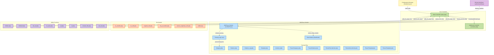

```mermaid
flowchart TD
    %% Configuration
    CONFIG["Configuration Manager (fixwikirefs.json)"]:::config

    %% Core Controller Subgraph
    subgraph "Core Controller"
        CTRL1["Main Controller (index.php)"]:::core
        CTRL2["Additional Controller (src/index.php)"]:::core
    end

    %% WikiParse Module Subgraph
    subgraph "WikiParse Module"
        WP["WikiParse Module (src/WikiParse)"]:::parser
        PARSER["Parsing Logic (src)"]:::parser
        DM["Data Models (DataModel)"]:::parser
        subgraph "Parsing Files"
            CAT["Category.php"]:::parser
            CIT["Citations.php"]:::parser
            CITREG["Citations_reg.php"]:::parser
            TPL["Template.php"]:::parser
            INC["include_it.php"]:::parser
            P_CAT["ParserCategorys.php"]:::parser
            P_CIT["ParserCitations.php"]:::parser
            P_EXT["ParserExternalLinks.php"]:::parser
            P_INT["ParserInternalLinks.php"]:::parser
            P_TPL["ParserTemplate.php"]:::parser
            P_TPLS["ParserTemplates.php"]:::parser
        end
    end

    %% Bot Module Subgraph
    subgraph "Bot Module"
        BOT1["es_months.php"]:::bot
        BOT2["es_refs.php"]:::bot
        BOT3["expend_refs.php"]:::bot
        BOT4["fix_pt_months.php"]:::bot
        BOT5["remove_duplicate_refs.php"]:::bot
        BOT6["txtlib2.php"]:::bot
    end

    %% Utility Functions Subgraph
    subgraph "Utility Functions"
        UTIL1["infobox.php"]:::util
        UTIL2["infobox2.php"]:::util
        UTIL3["md_cat.php"]:::util
        UTIL4["mv_dots.php"]:::util
        UTIL5["sw.php"]:::util
        UTIL6["es.php"]:::util
        UTIL7["include_files.php"]:::util
        UTIL8["test_bot.php"]:::util
    end

    %% CI/CD Integration
    CI["GitHub Workflows (.github/workflows)"]:::cicd

    %% Connections
    CONFIG -->|"loadConfig"| CTRL1

    %% Core Controller interactions
    CTRL1 -->|"calls_fix_page_here"| WP
    CTRL1 -->|"calls_fix_page_here"| BOT1
    CTRL1 -->|"calls_fix_page_here"| UTIL1
    CTRL1 -->|"includesAdditionalLogic"| CTRL2

    %% WikiParse Module connections
    WP -->|"initiates_parsing"| PARSER
    WP -->|"utilizes_data_models"| DM
    PARSER -->|"parsesCategories"| CAT

    %% Return flow back to Core Controller
    WP -->|"returns_parsed_data"| CTRL1
    BOT1 -->|"returns_bot_fixes"| CTRL1
    UTIL1 -->|"returns_util_output"| CTRL1

    %% CI/CD integration
    CI -->|"deploys_updates"| CTRL1

    %% Styles
    classDef core fill:#C5E1A5,stroke:#388E3C,stroke-width:2px;
    classDef parser fill:#BBDEFB,stroke:#1976D2,stroke-width:2px;
    classDef bot fill:#FFCCBC,stroke:#F57C00,stroke-width:2px;
    classDef util fill:#D1C4E9,stroke:#7B1FA2,stroke-width:2px;
    classDef config fill:#FFF9C4,stroke:#FBC02D,stroke-width:2px;
    classDef cicd fill:#E1BEE7,stroke:#8E24AA,stroke-width:2px;

    %% Click Events for Core Controller
    click CTRL1 "https://github.com/mdwiki-td/fix_refs/blob/main/index.php"
    click CTRL2 "https://github.com/mdwiki-td/fix_refs/blob/main/src/index.php"

    %% Click Events for WikiParse Module
    click WP "https://github.com/mdwiki-td/fix_refs/tree/main/src/WikiParse"
    click PARSER "https://github.com/mdwiki-td/fix_refs/tree/main/src/WikiParse/src"
    click DM "https://github.com/mdwiki-td/fix_refs/tree/main/src/WikiParse/src/DataModel"
    click CAT "https://github.com/mdwiki-td/fix_refs/blob/main/src/WikiParse/Category.php"
    click CIT "https://github.com/mdwiki-td/fix_refs/blob/main/src/WikiParse/Citations.php"
    click CITREG "https://github.com/mdwiki-td/fix_refs/blob/main/src/WikiParse/Citations_reg.php"
    click TPL "https://github.com/mdwiki-td/fix_refs/blob/main/src/WikiParse/Template.php"
    click INC "https://github.com/mdwiki-td/fix_refs/blob/main/src/WikiParse/include_it.php"
    click P_CAT "https://github.com/mdwiki-td/fix_refs/blob/main/src/WikiParse/src/ParserCategorys.php"
    click P_CIT "https://github.com/mdwiki-td/fix_refs/blob/main/src/WikiParse/src/ParserCitations.php"
    click P_EXT "https://github.com/mdwiki-td/fix_refs/blob/main/src/WikiParse/src/ParserExternalLinks.php"
    click P_INT "https://github.com/mdwiki-td/fix_refs/blob/main/src/WikiParse/src/ParserInternalLinks.php"
    click P_TPL "https://github.com/mdwiki-td/fix_refs/blob/main/src/WikiParse/src/ParserTemplate.php"
    click P_TPLS "https://github.com/mdwiki-td/fix_refs/blob/main/src/WikiParse/src/ParserTemplates.php"

    %% Click Events for Bot Module
    click BOT1 "https://github.com/mdwiki-td/fix_refs/blob/main/src/bots/es_months.php"
    click BOT2 "https://github.com/mdwiki-td/fix_refs/blob/main/src/bots/es_refs.php"
    click BOT3 "https://github.com/mdwiki-td/fix_refs/blob/main/src/bots/expend_refs.php"
    click BOT4 "https://github.com/mdwiki-td/fix_refs/blob/main/src/bots/fix_pt_months.php"
    click BOT5 "https://github.com/mdwiki-td/fix_refs/blob/main/src/bots/remove_duplicate_refs.php"
    click BOT6 "https://github.com/mdwiki-td/fix_refs/blob/main/src/bots/txtlib2.php"

    %% Click Events for Utility Functions
    click UTIL1 "https://github.com/mdwiki-td/fix_refs/blob/main/src/infobox.php"
    click UTIL2 "https://github.com/mdwiki-td/fix_refs/blob/main/src/infobox2.php"
    click UTIL3 "https://github.com/mdwiki-td/fix_refs/blob/main/src/md_cat.php"
    click UTIL4 "https://github.com/mdwiki-td/fix_refs/blob/main/src/mv_dots.php"
    click UTIL5 "https://github.com/mdwiki-td/fix_refs/blob/main/src/sw.php"
    click UTIL6 "https://github.com/mdwiki-td/fix_refs/blob/main/src/es.php"
    click UTIL7 "https://github.com/mdwiki-td/fix_refs/blob/main/src/include_files.php"
    click UTIL8 "https://github.com/mdwiki-td/fix_refs/blob/main/src/test_bot.php"

    %% Click Event for CI/CD
    click CI "https://github.com/mdwiki-td/fix_refs/tree/main/.github/workflows"
```
